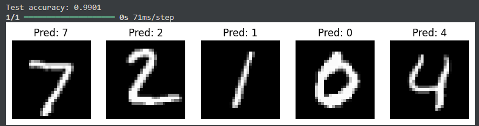

# 🧠 AI Tools Assignment – *Mastering the AI Toolkit*

**Authors:** Nwokike Onyeka, Obinwa Ogechi Perpetual, Stephen Ayankoso  
**Course:** AI Tools and Applications  
**Institution:** [Power Learn Project Academy]  
**Date:** October 2025  

---
# [Live URL](https://group71.streamlit.app/)
---

## 📘 Project Overview

This repository contains my complete submission for the **AI Tools Assignment** on the theme *“Mastering the AI Toolkit.”*  
The project demonstrates understanding and practical use of modern AI frameworks — **TensorFlow**, **PyTorch**, **Scikit-learn**, and **spaCy** — across theory, implementation, and ethics.

---

## 🧩 Assignment Structure

| Part | Description | Deliverable |
|------|--------------|--------------|
| **Part 1** | Theoretical Understanding of AI tools | [Theoretical_Answers.md](./Theoretical_Answers.md) |
| **Part 2 – Task 1** | Classical ML using Scikit-learn (Iris Classifier) | [Iris Classifier Notebook](./Iris_Classifier_JasonChiagozie.ipynb) |
| **Part 2 – Task 2** | Deep Learning using TensorFlow (MNIST CNN) | [MNIST CNN Notebook](./MNIST_CNN_JasonChiagozie.ipynb) |
| **Part 2 – Task 3** | NLP using spaCy (Entity & Sentiment Extraction) | [NLP Task](./NLP_Task_spaCy.md) |
| **Part 3** | Ethical Analysis and Reflection | [Ethical_Reflection.md](./Ethical_Reflection.md) |

---

## 🧠 Tools & Frameworks Used

- **TensorFlow** – for deep learning and CNN model building.  
- **Scikit-learn** – for classical machine learning (Decision Tree Classifier).  
- **spaCy** – for NLP tasks like Named Entity Recognition and Sentiment Analysis.  
- **Jupyter Notebook / Google Colab** – for experimentation and visualization.  
- **GitHub** – for version control and project submission.

---

## 🧪 Results Summary

### **Iris Classifier**
- Algorithm: Decision Tree Classifier  
- Accuracy: ~97%  
- Evaluation Metrics: Accuracy, Precision, Recall  

### **MNIST CNN**
- Model: Convolutional Neural Network  
- Test Accuracy: >99%  
- Output: Classification of handwritten digits (0–9)  

### **NLP with spaCy**
- Task: Named Entity Recognition and Rule-Based Sentiment Analysis  
- Entities Extracted: Product Names, Brands  
- Sentiment Output: Positive / Negative summary  

---

## ⚖️ Ethical Reflection Summary

This project emphasizes **responsible AI use** — addressing bias, fairness, transparency, privacy, and human accountability.  
See the full write-up: [Ethical_Reflection.md](./Ethical_Reflection.md)

---

### **MNIST CNN Result Screenshot**
Below is the output of our trained CNN model showing predictions on test images:

**Figure:** The CNN model correctly predicted digits *7, 2, 1, 0,* and *4* from the MNIST test set, achieving a test accuracy of **99.01%**.

## 🏁 Final Notes

This project demonstrates the practical application of AI frameworks in **machine learning, deep learning, and NLP** — combined with ethical awareness.  
It fulfills all parts of the *AI Tools Assignment* and serves as a foundation for future AI engineering projects.

---

> 💡 *“Small wins lead to big successes — test code incrementally and think ethically.”*
